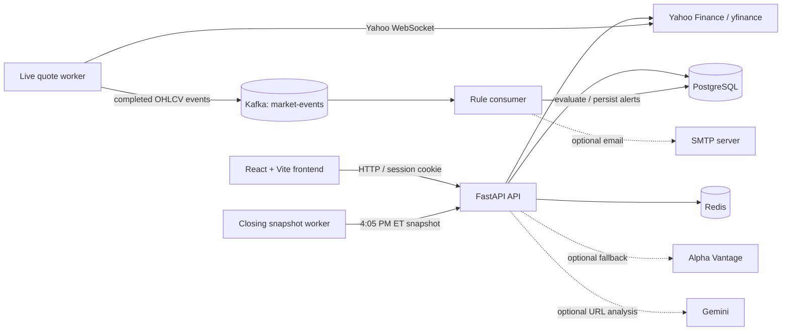
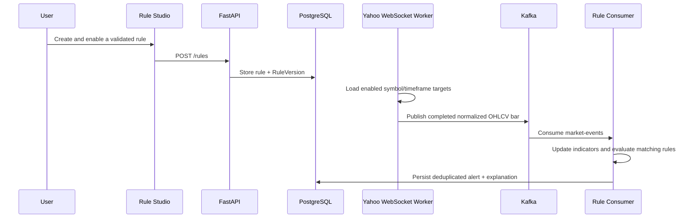
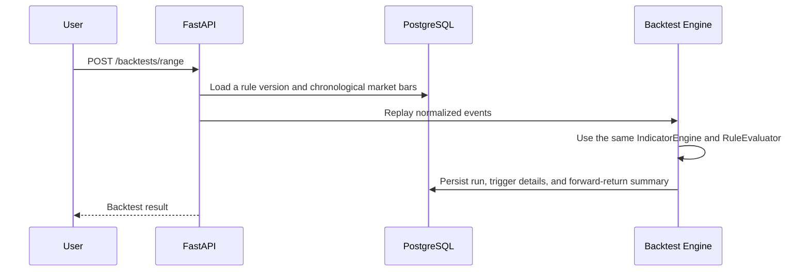
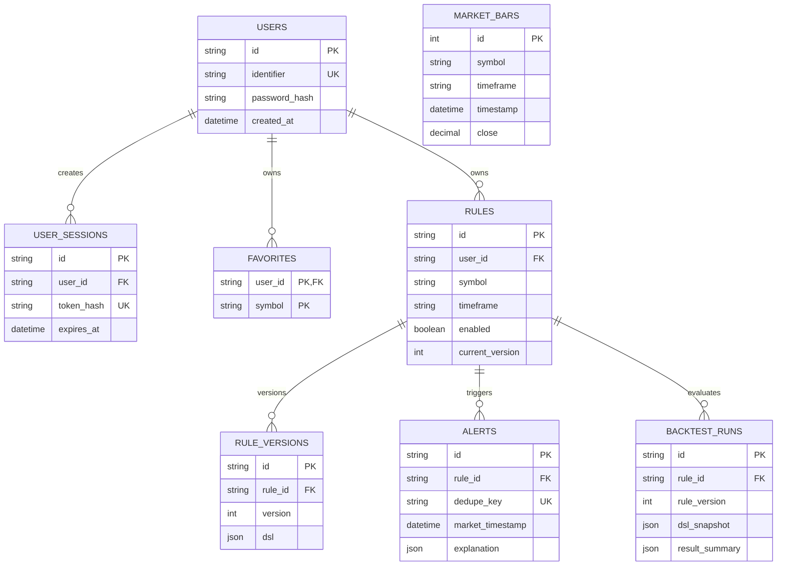

# [CandleRelay](https://github.com/aiaiaiyihao/CandleRelay-Event-Driven-Stock-Alerts)

CandleRelay is a full-stack market workspace that turns validated stock-alert rules into both live event processing and reproducible historical backtests.

## Overview

Retail investors and analysts often have to monitor many price, moving-average, and volume conditions manually. CandleRelay provides a single workflow for creating a market rule in natural language, reviewing the validated Rule DSL it produces, monitoring live market events, and replaying that same rule against stored OHLCV bars.

The project is intentionally built around one core invariant: **live monitoring and historical replay use the same normalized events, indicator engine, and rule evaluator**. This makes a signal explainable and testable instead of treating backtesting as a separate implementation.

The React application exposes that workflow through a market dashboard, a user-owned Favorites workspace, stock detail views, and a Rule Studio. The FastAPI backend persists rules and results in PostgreSQL, shares market-data snapshots through Redis, and processes enabled alerts through Kafka.

## Key Features

- **Natural-language rule compilation** — converts supported English and Chinese rule text into a strictly validated, versioned Rule DSL before a rule can be saved.
- **Shared live and historical rule engine** — evaluates normalized OHLCV events with the same incremental indicators and evaluator for Kafka-driven monitoring and backtests.
- **Explainable alerts** — stores the matched conditions, operands, operators, and values that produced each trigger.
- **Trigger controls** — supports `while_true` and false-to-true trigger modes, per-rule cooldowns, and database-backed duplicate prevention.
- **Live alert subscriptions** — a Yahoo Finance WebSocket worker subscribes only to symbols used by enabled rules, aggregates quotes into requested bar intervals, and publishes completed bars to Kafka.
- **Historical replay** — imports CSV market bars, runs inline or date-range backtests, persists rule-version snapshots, trigger counts, and forward-return summaries.
- **Market exploration** — shows major US indexes, paginated gainers and losers, sector performance, sector constituents, ticker search, stock details, adaptive charts, and recent news.
- **Favorites and accounts** — supports email or international-phone registration, hashed passwords, HTTP-only sessions, user-scoped Favorites, sorting, pagination, and aggregated Favorites news.
- **Stock charts** — supports line and candlestick views, volume, SMA 20/50/200 overlays, pan/zoom controls, and range-specific data resolution from 30 minutes to maximum available history.
- **Market assistant** — answers market, ticker-price, and cached-news questions using existing market/news data; optional Gemini analysis can enrich cached source URLs without adding a search provider.
- **Resilient market-data caching** — uses short-lived live Redis snapshots, closing snapshots retained until the next market open, and an Alpha Vantage movers fallback when configured.

## Architecture



### Live-rule path



### Historical replay path



## Tech Stack

| Category | Technologies used |
| --- | --- |
| Backend | Python, FastAPI, Pydantic, SQLAlchemy |
| Frontend | React, Vite, Recharts |
| Database | PostgreSQL, Alembic |
| Cache | Redis |
| Messaging | Apache Kafka via Confluent Kafka Python client, ZooKeeper (local Compose stack) |
| Market data | yfinance / Yahoo Finance; optional Alpha Vantage fallback |
| AI enrichment | Optional Google Gemini URL-context analysis |
| Notifications | In-app persisted alerts; optional SMTP email delivery |
| Infrastructure | Docker, Docker Compose, Nginx frontend container |
| Testing | pytest, FastAPI test client, in-memory SQLite fixtures, mocked external providers |

## Important Engineering Decisions

### One evaluator for live monitoring and backtests

`MarketEvent` is a validated, immutable, timezone-aware OHLCV contract. Both the Kafka consumer and `BacktestEngine` feed events through `IndicatorEngine` and `RuleEvaluator`. Reusing this path reduces drift between a strategy result and its live behavior.

### Rules are versioned rather than overwritten

Each saved rule owns ordered `RuleVersion` records with a unique `(rule_id, version)` constraint. Updating a rule creates a new definition version; backtests store both the rule version and DSL snapshot used. This preserves the definition behind historical results.

### Event processing is idempotent at the persistence boundary

The live processor ignores non-increasing timestamps per symbol/timeframe and generates an alert dedupe key from the rule, version, and market timestamp. PostgreSQL enforces the key’s uniqueness. The Kafka consumer commits its offset only after processing and optional email handling return, which favors replaying a message over silently skipping one after a failure.

### Indicators are warmed before the visible chart window

Chart endpoints request enough history to calculate SMAs, calculate indicators on the complete provider series, and clip only afterward. Short windows can therefore display a valid SMA 20/50/200 at their left edge when enough prior data exists. All chart series use the same returned trading-session data.

### Caches protect data providers and preserve the close

Live market overviews are shared in Redis for five minutes, while in-process caching absorbs repeated requests for a minute. A scheduled worker attempts a 4:05 PM ET weekday snapshot; closing overview and popular/Favorite details remain cached until the next weekday 9:30 AM ET open. The implementation skips weekends but does not maintain an exchange-holiday calendar.

### Live subscription scope follows enabled rules

The quote worker refreshes the set of enabled `(symbol, timeframe)` targets every 15 seconds and subscribes only to their symbols. It aggregates incoming Yahoo WebSocket quotes into requested bars before publishing to the `market-events` topic, rather than streaming every tracked market symbol through Kafka.

### Authorization is resource-scoped

Authenticated routes use a server-side session lookup. Favorites are keyed by `(user_id, symbol)` and rule queries are filtered by owner. Alert listing and acknowledgement resolve ownership through the alert’s rule.

## Project Structure

```text
app/
├── api/             FastAPI routers for auth, market data, rules, alerts, and backtests
├── backtesting/     Chronological replay and forward-return calculations
├── compilers/       Compiler interface and validated heuristic NLP compiler
├── domain/          Rule DSL and immutable MarketEvent contracts
├── indicators/      Incremental technical-indicator calculations
├── kafka/           Event codec, producer, and manual-offset consumer
├── models/          SQLAlchemy entities
├── rules/           Rule evaluation and indicator requirement discovery
├── services/        Market data, caching, auth, alerts, and application workflows
└── workers/         Yahoo quote stream and closing-snapshot processes

frontend/
├── src/App.jsx      Main React application and page-level interactions
├── src/api.js       API client
└── src/styles.css   Financial-terminal visual system and responsive layout

migrations/          Alembic schema history
scripts/             CSV market-bar import utility
examples/            NVDA CSV fixture used by the demo flow
tests/               Unit, API, worker, caching, chart, and end-to-end tests
docker/              Backend image and complete local Compose stack
```

## Data Model



Additional persisted tables include legacy `poll_jobs`, `raw_market_data`, `symbol_averages`, and the application-wide `watchlist_items`. `market_bars` has a unique `(symbol, timeframe, timestamp)` constraint; alerts have a unique dedupe key; and rules, bars, alerts, users, and sessions use the indexes introduced by the Alembic migrations for their common lookup paths.

## API Overview

Interactive OpenAPI documentation is available at `http://localhost:8000/docs` while the stack is running.

### Authentication and user data

| Method | Endpoint | Description | Auth |
| --- | --- | --- | --- |
| `POST` | `/auth/register` | Register with email or international phone number; creates a session | No |
| `POST` | `/auth/login` | Authenticate and create a session | No |
| `GET` | `/auth/me` | Read the current user | Session |
| `POST` | `/auth/logout` | Delete the current session | Optional session |
| `GET` | `/favorites` | List the current user’s Favorites | Session |
| `POST` | `/favorites` | Add a ticker to the current user’s Favorites | Session |
| `DELETE` | `/favorites/{symbol}` | Remove a Favorite | Session |
| `GET` | `/favorites/news` | Aggregate cached news for a user’s Favorites | Session |

### Rules, backtests, and alerts

| Method | Endpoint | Description | Auth |
| --- | --- | --- | --- |
| `POST` | `/rules/compile` | Compile supported natural-language text into validated DSL | No |
| `POST` | `/rules` | Save a user-owned rule and first version | Session |
| `GET` | `/rules` | List the current user’s rules | Session |
| `GET` | `/rules/{rule_id}` | Read one owned rule | Session |
| `PUT` | `/rules/{rule_id}` | Create a new rule version | Session |
| `GET` | `/rules/{rule_id}/versions` | List a rule’s definitions | Session |
| `PATCH` | `/rules/{rule_id}/status` | Enable or pause a rule | Session |
| `DELETE` | `/rules/{rule_id}` | Delete a rule and its alerts | Session |
| `POST` | `/backtests` | Backtest supplied normalized events | No |
| `POST` | `/backtests/range` | Backtest imported bars in a time range | No |
| `GET` | `/backtests/{run_id}` | Read a backtest result | No |
| `GET` | `/alerts` | List alerts, optionally by rule or acknowledgement state | Optional session |
| `POST` | `/alerts/{alert_id}/acknowledge` | Acknowledge an alert | Optional session |

### Markets and stocks

| Method | Endpoint | Description | Auth |
| --- | --- | --- | --- |
| `GET` | `/market/overview` | Indexes, Top 50 gainers/losers, and sector proxies | No |
| `GET` | `/market/quotes` | Snapshot up to 50 requested symbols | No |
| `GET` | `/market/sectors/{sector_slug}/stocks` | Paginated sector constituents | No |
| `POST` | `/market/chat` | Ask the Market Assistant about cached market data/news | No |
| `GET` | `/stocks/search` | Search equities and ETFs | No |
| `GET` | `/stocks/{symbol}/detail` | Quote, fundamentals, and cached news | No |
| `GET` | `/stocks/{symbol}/chart` | OHLCV, volume, and SMA chart data | No |
| `GET` | `/stocks/{symbol}/news` | Cached Yahoo news | No |
| `GET` | `/prices/latest` | Legacy latest-price lookup | No |
| `POST` | `/prices/poll` | Legacy polling-job endpoint | No |
| `GET/POST/DELETE` | `/watchlist` | Application-wide tracked-symbol watchlist | No |

## Core Workflows

### Create and monitor a rule

1. The user writes a supported condition such as “Alert me when NVDA crosses below SMA20 and volume is more than 2 times the average of the past 20 trading days.”
2. `POST /rules/compile` returns a candidate DSL, human-readable explanation, and warnings; invalid DSL shapes are rejected by Pydantic validation.
3. An authenticated user saves the reviewed definition through `POST /rules` and can enable, pause, update, or delete it.
4. The quote worker subscribes to enabled rule symbols, builds the rule’s requested bar timeframes, and publishes completed `MarketEvent` records to Kafka.
5. The consumer updates indicators, evaluates matching rules, persists any non-duplicate trigger, and optionally sends email notifications when SMTP is configured.

### Backtest a rule

1. Import normalized historical CSV data into `market_bars`.
2. Submit a rule ID plus an inline event set or a timezone-aware start/end range.
3. The backtest engine orders bars chronologically and replays them with the shared indicator/evaluation pipeline.
4. CandleRelay stores the rule-version snapshot, detailed trigger evaluations, and one-, five-, and twenty-bar forward-return averages in the backtest record.

### Explore and save a stock

1. Search a company or ticker from the Dashboard or Favorites page.
2. Inspect stock detail, chart interval/range, price data, volume, moving averages, and cached news.
3. Sign in and star the symbol to save it in a private Favorite list.
4. Use the Favorites workspace to sort holdings, select a chart, and review aggregated Favorite news.

## Getting Started

### Prerequisites

The simplest supported local setup requires:

- Docker Engine with Docker Compose v2
- Internet access for Yahoo Finance data (and optional external providers)

For non-container development, the source uses Python type-union syntax and should be run with **Python 3.10+**. The frontend requires Node.js and npm; the repository does not pin a Node version.

### Run with Docker Compose

```bash
git clone https://github.com/aiaiaiyihao/CandleRelay-Event-Driven-Stock-Alerts.git
cd CandleRelay-Event-Driven-Stock-Alerts
docker compose -f docker/docker-compose.yml up -d --build
```

The API service runs `alembic upgrade head` before starting. Compose starts PostgreSQL, Redis, ZooKeeper, Kafka, a Kafka topic initializer, the API, the signal consumer, the Yahoo live-quote worker, the closing-snapshot worker, and the frontend.

Open:

| Surface | URL |
| --- | --- |
| Dashboard | <http://localhost:3000/dashboard> |
| My Favorites | <http://localhost:3000/favorites> |
| Rule Studio | <http://localhost:3000/rule-studio> |
| API documentation | <http://localhost:8000/docs> |
| Health check | <http://localhost:8000/health> |

Useful commands:

```bash
# Follow all service logs
docker compose -f docker/docker-compose.yml logs -f

# Inspect service health
docker compose -f docker/docker-compose.yml ps

# Stop containers while retaining the named PostgreSQL volume
docker compose -f docker/docker-compose.yml down
```

### Optional environment variables

Docker Compose loads optional provider and SMTP settings from `docker/.env`. The file is intentionally ignored by Git. The Compose stack already supplies its internal PostgreSQL, Redis, and Kafka connection URLs.

| Variable | Description | Required |
| --- | --- | --- |
| `ALPHA_VANTAGE_API_KEY` | Enables Alpha Vantage movers fallback | No |
| `GEMINI_API_KEY` | Enables Gemini analysis of cached public news URLs | No |
| `GEMINI_MODEL` | Gemini model name; default is `gemini-3.1-flash-lite` | No |
| `SMTP_HOST` | SMTP server hostname for email alerts | No |
| `SMTP_PORT` | SMTP port; defaults to `587` | No |
| `SMTP_USERNAME` | SMTP username | No |
| `SMTP_PASSWORD` | SMTP password | No |
| `SMTP_FROM_EMAIL` | Sender address; defaults to `SMTP_USERNAME` | No |
| `SMTP_USE_TLS` | Enables SMTP TLS; defaults to `true` | No |

Example `docker/.env` values use placeholders only:

```dotenv
ALPHA_VANTAGE_API_KEY=replace_with_key
GEMINI_API_KEY=replace_with_key
GEMINI_MODEL=gemini-3.1-flash-lite
SMTP_HOST=smtp.example.com
SMTP_PORT=587
SMTP_USERNAME=alerts@example.com
SMTP_PASSWORD=replace_with_password
SMTP_FROM_EMAIL=alerts@example.com
SMTP_USE_TLS=true
```

For a local, non-container API process, the backend also recognizes `DATABASE_URL`, `REDIS_URL`, `KAFKA_BOOTSTRAP`, `KAFKA_SIGNAL_GROUP`, `CORS_ORIGINS`, `APP_NAME`, `APP_VERSION`, and `APP_DEBUG`. The defaults expect PostgreSQL at `localhost:5432`, Redis at `localhost:6379`, and Kafka at `localhost:9092`.

### Develop the backend without the API container

Start PostgreSQL, Redis, and Kafka through Compose first, then run:

```bash
python -m venv .venv
source .venv/bin/activate
pip install -r requirements/dev.txt
alembic upgrade head
uvicorn app.main:app --reload
```

Run the event workers in separate terminals when needed:

```bash
python -m app.kafka.SignalConsumer
python -m app.workers.live_quotes
python -m app.workers.closing_snapshot
```

### Develop the frontend

```bash
cd frontend
npm install
npm run dev
```

The default API target is `http://localhost:8000`. Set `VITE_API_URL` in `frontend/.env` to override it for a different local API origin.

### Import the included demo data

```bash
python -m scripts.import_market_bars examples/nvda_daily.csv \
  --symbol NVDA --timeframe 1d --source demo
```

## Usage Examples

### Compile a rule

```bash
curl -X POST http://localhost:8000/rules/compile \
  -H 'Content-Type: application/json' \
  -d '{
    "text": "Alert me when NVDA crosses below SMA20 and volume is more than 2 times the average of the past 20 trading days.",
    "cooldown_seconds": 3600
  }'
```

The response includes a typed DSL such as:

```json
{
  "dsl_version": "1.0",
  "symbol": "NVDA",
  "timeframe": "1d",
  "conditions": {
    "all": [
      {
        "left": {"type": "metric", "metric": "price"},
        "operator": "crosses_below",
        "right": {"type": "indicator", "indicator": "sma", "period": 20}
      },
      {
        "left": {"type": "indicator", "indicator": "volume_ratio", "period": 20},
        "operator": ">",
        "right": {"type": "value", "value": 2}
      }
    ]
  },
  "trigger": "on_false_to_true",
  "cooldown_seconds": 3600
}
```

### Query market data

```bash
curl 'http://localhost:8000/market/overview'
curl 'http://localhost:8000/stocks/NVDA/chart?period=3mo'
curl 'http://localhost:8000/market/sectors/technology/stocks?page=1&page_size=10&sort_order=desc'
```

### Create an account and save a Favorite

```bash
# Save the session cookie locally for subsequent authenticated calls.
curl -c cookies.txt -X POST http://localhost:8000/auth/register \
  -H 'Content-Type: application/json' \
  -d '{"identifier":"analyst@example.com","password":"a-demo-password"}'

curl -b cookies.txt -X POST http://localhost:8000/favorites \
  -H 'Content-Type: application/json' \
  -d '{"symbol":"NVDA"}'
```

## Testing

Run the complete backend suite from the repository root:

```bash
pytest -q
```

Build the frontend production bundle:

```bash
npm --prefix frontend run build
```

Validate the Compose configuration:

```bash
docker compose -f docker/docker-compose.yml config
```

The pytest suite covers, among other behavior:

- Rule DSL validation, heuristic compilation, condition evaluation, and required indicators
- Live processing, cooldowns, alert deduplication, manual Kafka-offset handling, and email dispatch behavior
- Backtest persistence and the full NVDA natural-language-to-trigger demo
- API validation for auth, rules, alerts, backtests, Favorites, watchlist, and health endpoints
- Redis cache behavior, closing-snapshot expiration, provider fallback, market-overview sorting, and news handling
- Chart sampling, indicator warmup before display clipping, OHLCV aggregation, and chart API responses
- Safe startup behavior that does not create or drop tables outside Alembic migrations

## Security and Data Integrity

- Passwords use PBKDF2-HMAC-SHA256 with a random 16-byte salt and 600,000 iterations.
- Session tokens are random, stored server-side only as SHA-256 hashes, expire after seven days, and are sent as HTTP-only, `SameSite=Lax` cookies.
- Request schemas reject unknown fields and validate identifiers, password length, symbols, timezone-aware timestamps, OHLCV ranges, and DSL operands.
- Favorite ownership uses a composite primary key, and rule/alert access is filtered by the authenticated user when a session is present.
- Database migrations, not application startup, own schema creation. The test suite explicitly checks that startup does not call `create_all()` or `drop_all()`.
- Rule-version, market-bar, and alert-deduplication constraints preserve reproducibility and prevent duplicate alert rows.

This is a local-development portfolio project. In particular, the current cookie configuration sets `secure=False`; deploy behind HTTPS with secure cookies and production secret/configuration management before exposing it publicly.

## Performance and Reliability

- Redis caches live market overview, stock details, charts, news, and optional news analysis to reduce repeated upstream requests.
- Gainers and losers return 50 ranked symbols for client-side pagination; sector constituents and market quotes cap request sizes at the API boundary.
- Market overview refreshes use a shared Redis snapshot, a last-known-good snapshot, and an optional Alpha Vantage fallback when yfinance screeners fail.
- The closing worker uses a Redis `NX` lock keyed by date so only one worker produces a daily snapshot.
- Quote subscriptions are limited to enabled alert symbols; snapshot warmup of popular and Favorite tickers uses bounded concurrency.
- Kafka producer idempotence is enabled, and the consumer commits offsets only after processing succeeds.

## Current Limitations

- Market data, news, and live quote delivery depend on Yahoo Finance/yfinance availability and its data quality; the project is not a trading or investment-advice system.
- The market-closed cache only skips weekends; it does not recognize US exchange holidays or early closes.
- Market overview universe/screening behavior depends on upstream screener results and is not a complete security master for every US-listed instrument.
- Live alert coverage is limited to enabled rules and the supported `1m`, `5m`, `15m`, `1h`, and `1d` rule timeframes.
- The natural-language compiler is heuristic and supports defined rule phrasing; it is not a general-purpose LLM compiler.
- Backtests run synchronously within the API process and rely on imported bars or caller-supplied events; there is no job queue or distributed backtest execution.
- Email delivery is optional and has no provider-specific retry queue or delivery-status tracking.
- No CI/CD workflow, hosted deployment configuration, screenshots, or license file is currently included in this repository.

## Future Improvements

The following are reasonable next steps, but are **not implemented** in this repository:

- Exchange-calendar support for holidays and early closes
- Background-job orchestration for large historical backtests
- Provider-independent data adapters with rate limiting, retries, and health metrics
- Configurable notification channels and durable email retry handling
- Production HTTPS deployment, secure cookies, CSRF strategy, and observability
- Automated CI for backend tests and frontend builds

## Contributing

1. Create a focused branch for one change.
2. Add or update pytest coverage for backend behavior and run `pytest -q`.
3. Run `npm --prefix frontend run build` for frontend changes.
4. Add database changes through a new Alembic migration; do not alter tables during application startup.
5. Keep external-provider credentials in ignored environment files.

## License

No license file is currently included. Do not assume reuse permissions until a license is added by the repository owner.
